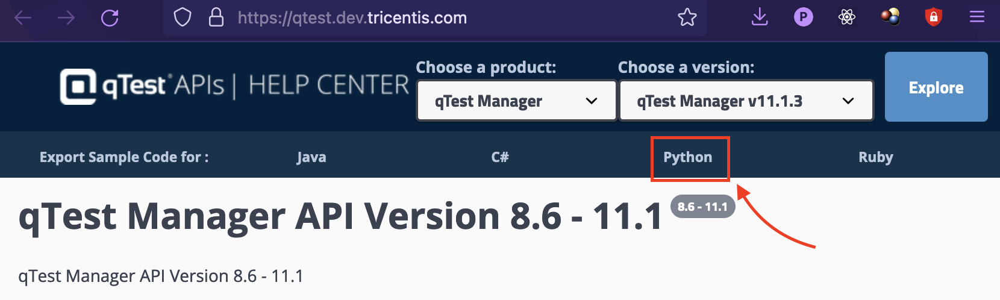

# ARCHIVED: Python QTest Library

A client library to interact with the qTest API, which one can reference here: [api.qasymphony.com](https://api.qasymphony.com/)

## Archived Notice:
While working for a previous company, I wrote this to support some individuals that needed programatic access to
the QASymphony API. I do not have the time to allocate to continued support for this project, unfortunatley. I
have decided to archive this solution to keep code as a reference, but I will no longer be updating or maintaining
this project.

As a substitute, you are free to leverage the automatically generated API provided directly from them.


## Installation
```bash
pip install qasymphony-qtest-library
```

## Usage

```python
from qtest import qtest

qtest = qtest.QTestClient(username="username@yourco.com", password="password", site_name="yourco")
all_projects = qtest.get_projects()
project_names = [project['name'] for project in all_projects]
print(project_names)
```
